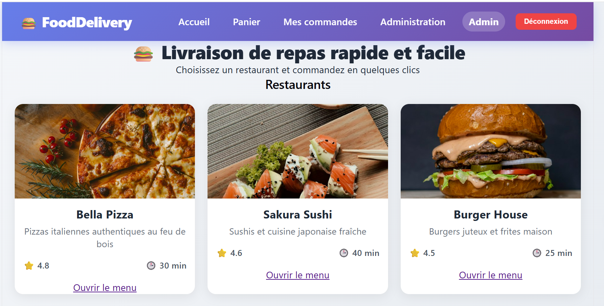

# Food Delivery App

Application web de livraison de nourriture.

## Aperçu

## Technologies

### Back-end
- C# / ASP.NET Core 8
- Entity Framework Core
- PostgreSQL
- JWT Authentication
- BCrypt
- Swagger

### Front-end
- React.js
- Vite
- React Router
- Axios

### Outils de test
- Postman (tests d'API)
- Swagger (documentation interactive)

## Fonctionnalités

- Authentification (inscription, connexion)
- Gestion des restaurants et menus
- Panier d'achat
- Passage de commandes
- Suivi de commande en temps réel
- Panneau d'administration
- Tests d'API avec Postman

## Structure

- `backend/` : API REST en C# / ASP.NET Core
- `frontend/` : Interface React avec Vite

## Auteur

Dioline Brinda TSOMENE LOKO
